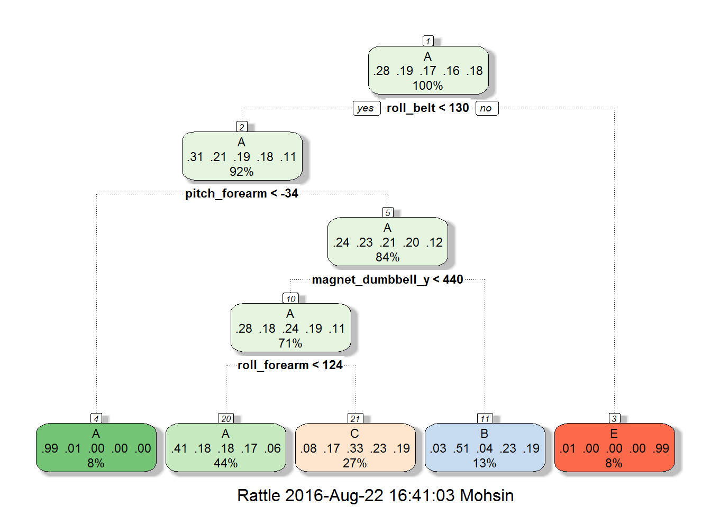
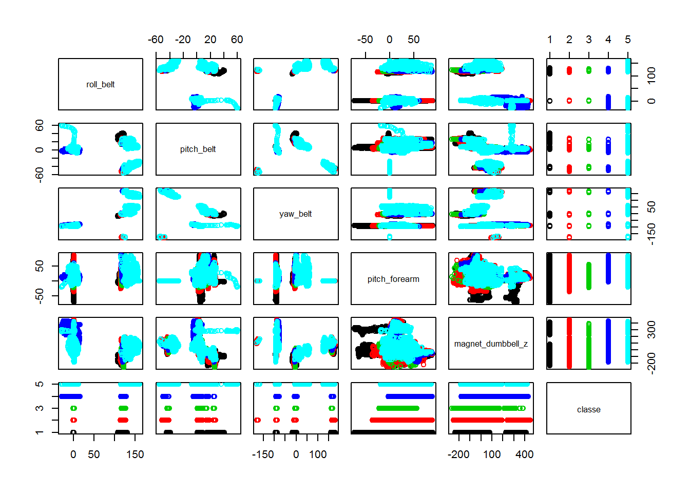

Overview
========

In this project my goal is to use data from accelerometers on the belt,
forearm, arm, and dumbell of 6 participants to answer "how well they" do
those activities. Machine learning algorithm will be developed to
correctly classify the quality of barbell bicep curls by using data from
above mentioned activity monitors.

More information regarding data collection and description of data is
available from the website here:
<http://groupware.les.inf.puc-rio.br/har> (see the section on the Weight
Lifting Exercise Dataset).

Data obtaining and cleaning
===========================

The data for this project come from this source:
<http://groupware.les.inf.puc-rio.br/har>. In the following code chunk I
am processing data to make them ready for analysis. For cross validation
purpose I will split training data set in two sets. First set will be
used to train and the second set will be to validate.

Obtaining data:
---------------

    train_url<-"https://d396qusza40orc.cloudfront.net/predmachlearn/pml-training.csv"
    test_url<-"https://d396qusza40orc.cloudfront.net/predmachlearn/pml-testing.csv"
    training_data <- read.csv(url(train_url), na.strings=c("NA","#DIV/0!",""))
    testing_data <- read.csv(url(test_url), na.strings=c("NA","#DIV/0!",""))

Splitting traning set for Cross Validation:
-------------------------------------------

    library(caret) ; set.seed(101010)                                       

    ## Warning: package 'caret' was built under R version 3.3.1

    ## Loading required package: lattice

    ## Loading required package: ggplot2

    inTrain <- createDataPartition(y=training_data$classe, p=0.8, list=F)   # Splitting training set further.
    train1 <- training_data[inTrain, ]  ; train2 <- training_data[-inTrain,]

Cleaning and getting rid of unnecessary variables:
--------------------------------------------------

    nzv <- nearZeroVar(train1)                                              #Near zero variance
    train1 <- train1[, -nzv]; train2 <- train2[, -nzv]                      #removing variable with near zero variance.
    mostlyNA <- sapply(train1, function(x) mean(is.na(x))) > 0.90
    train1 <- train1[, mostlyNA==F] ; train2 <- train2[, mostlyNA==F]       #removing variable with >90% NA 
    names(train1)[1:10]

    ##  [1] "X"                    "user_name"            "raw_timestamp_part_1"
    ##  [4] "raw_timestamp_part_2" "cvtd_timestamp"       "num_window"          
    ##  [7] "roll_belt"            "pitch_belt"           "yaw_belt"            
    ## [10] "total_accel_belt"

    train1<-train1[,-(1:6)]; train2<-train2[,-(1:6)];                       #Removing unncessary first 6 columns.  
    dim(train1)

    ## [1] 15699    53

    cols<-colnames(train1[,-53])
    test<-testing_data[cols]

Machine Learning Model Building
===============================

In this section accuracy of "Decision Tree" and "Random Forest" based
machine learning algorithm will be compared to see which one best
performs in correctly identifying the class of activities for this given
data set.

Decision tree (rpart):
----------------------

    library(rpart) ; library(rpart.plot) ; library(rattle)  #loadidng libraries for fancy plots

    ## Warning: package 'rpart.plot' was built under R version 3.3.1

    ## Warning: package 'rattle' was built under R version 3.3.1

    ## Rattle: A free graphical interface for data mining with R.
    ## Version 4.1.0 Copyright (c) 2006-2015 Togaware Pty Ltd.
    ## Type 'rattle()' to shake, rattle, and roll your data.

    modFit <- train(classe ~ .,method="rpart",data=train1)  #model fitting with decision tree
    fancyRpartPlot(modFit$finalModel)                       #fancy plotting tree

    pred<-predict(modFit,newdata = train2)
    confusionMatrix(pred,train2$classe)

    ## Confusion Matrix and Statistics
    ## 
    ##           Reference
    ## Prediction    A    B    C    D    E
    ##          A 1027  333  320  303  121
    ##          B   15  246   19  110  106
    ##          C   74  180  345  230  168
    ##          D    0    0    0    0    0
    ##          E    0    0    0    0  326
    ## 
    ## Overall Statistics
    ##                                           
    ##                Accuracy : 0.4955          
    ##                  95% CI : (0.4798, 0.5113)
    ##     No Information Rate : 0.2845          
    ##     P-Value [Acc > NIR] : < 2.2e-16       
    ##                                           
    ##                   Kappa : 0.3392          
    ##  Mcnemar's Test P-Value : NA              
    ## 
    ## Statistics by Class:
    ## 
    ##                      Class: A Class: B Class: C Class: D Class: E
    ## Sensitivity            0.9203  0.32411  0.50439   0.0000   0.4521
    ## Specificity            0.6163  0.92099  0.79870   1.0000   1.0000
    ## Pos Pred Value         0.4881  0.49597  0.34604      NaN   1.0000
    ## Neg Pred Value         0.9511  0.85031  0.88414   0.8361   0.8902
    ## Prevalence             0.2845  0.19347  0.17436   0.1639   0.1838
    ## Detection Rate         0.2618  0.06271  0.08794   0.0000   0.0831
    ## Detection Prevalence   0.5363  0.12643  0.25414   0.0000   0.0831
    ## Balanced Accuracy      0.7683  0.62255  0.65154   0.5000   0.7261

Almost less than 50% accuracy is obtained with decision tree based
algorithm which is not acceptable.

Random Forest:
--------------

    library(randomForest)

    ## Warning: package 'randomForest' was built under R version 3.3.1

    ## randomForest 4.6-12

    ## Type rfNews() to see new features/changes/bug fixes.

    ## 
    ## Attaching package: 'randomForest'

    ## The following object is masked from 'package:ggplot2':
    ## 
    ##     margin

    mod_rf <- randomForest(classe~.,data=train1,ntrees = 8)
    mod_rf

    ## 
    ## Call:
    ##  randomForest(formula = classe ~ ., data = train1, ntrees = 8) 
    ##                Type of random forest: classification
    ##                      Number of trees: 500
    ## No. of variables tried at each split: 7
    ## 
    ##         OOB estimate of  error rate: 0.39%
    ## Confusion matrix:
    ##      A    B    C    D    E  class.error
    ## A 4462    2    0    0    0 0.0004480287
    ## B   11 3024    3    0    0 0.0046082949
    ## C    0   14 2720    4    0 0.0065741417
    ## D    0    0   16 2554    3 0.0073843762
    ## E    0    0    3    6 2877 0.0031185031

Cross validation:
-----------------

    pred_rf<-predict(mod_rf,newdata=train2)
    confusionMatrix(pred_rf,train2$classe) #99.64% accuracy

    ## Confusion Matrix and Statistics
    ## 
    ##           Reference
    ## Prediction    A    B    C    D    E
    ##          A 1115    2    0    0    0
    ##          B    1  757    3    0    0
    ##          C    0    0  681    8    0
    ##          D    0    0    0  635    0
    ##          E    0    0    0    0  721
    ## 
    ## Overall Statistics
    ##                                         
    ##                Accuracy : 0.9964        
    ##                  95% CI : (0.994, 0.998)
    ##     No Information Rate : 0.2845        
    ##     P-Value [Acc > NIR] : < 2.2e-16     
    ##                                         
    ##                   Kappa : 0.9955        
    ##  Mcnemar's Test P-Value : NA            
    ## 
    ## Statistics by Class:
    ## 
    ##                      Class: A Class: B Class: C Class: D Class: E
    ## Sensitivity            0.9991   0.9974   0.9956   0.9876   1.0000
    ## Specificity            0.9993   0.9987   0.9975   1.0000   1.0000
    ## Pos Pred Value         0.9982   0.9947   0.9884   1.0000   1.0000
    ## Neg Pred Value         0.9996   0.9994   0.9991   0.9976   1.0000
    ## Prevalence             0.2845   0.1935   0.1744   0.1639   0.1838
    ## Detection Rate         0.2842   0.1930   0.1736   0.1619   0.1838
    ## Detection Prevalence   0.2847   0.1940   0.1756   0.1619   0.1838
    ## Balanced Accuracy      0.9992   0.9981   0.9966   0.9938   1.0000

Prediction with test set:
-------------------------

    pred_test<-predict(mod_rf,newdata = test) #results of test
    pred_test

    ##  1  2  3  4  5  6  7  8  9 10 11 12 13 14 15 16 17 18 19 20 
    ##  B  A  B  A  A  E  D  B  A  A  B  C  B  A  E  E  A  B  B  B 
    ## Levels: A B C D E

Important variables:
--------------------

    varImp(mod_rf)

    ##                         Overall
    ## roll_belt            1014.46037
    ## pitch_belt            547.57756
    ## yaw_belt              719.66847
    ## total_accel_belt      168.74541
    ## gyros_belt_x           76.27699
    ## gyros_belt_y           88.72071
    ## gyros_belt_z          245.51851
    ## accel_belt_x           89.10328
    ## accel_belt_y           99.82074
    ## accel_belt_z          326.70295
    ## magnet_belt_x         199.06616
    ## magnet_belt_y         300.73667
    ## magnet_belt_z         312.97055
    ## roll_arm              261.20176
    ## pitch_arm             145.10319
    ## yaw_arm               198.02171
    ## total_accel_arm        81.25077
    ## gyros_arm_x           109.97707
    ## gyros_arm_y           111.15300
    ## gyros_arm_z            45.25894
    ## accel_arm_x           195.10396
    ## accel_arm_y           123.72049
    ## accel_arm_z           106.93436
    ## magnet_arm_x          206.30579
    ## magnet_arm_y          174.30878
    ## magnet_arm_z          146.08746
    ## roll_dumbbell         319.76022
    ## pitch_dumbbell        145.34823
    ## yaw_dumbbell          204.57846
    ## total_accel_dumbbell  223.00233
    ## gyros_dumbbell_x      101.30163
    ## gyros_dumbbell_y      195.94989
    ## gyros_dumbbell_z       72.69310
    ## accel_dumbbell_x      201.26375
    ## accel_dumbbell_y      336.70009
    ## accel_dumbbell_z      263.75173
    ## magnet_dumbbell_x     380.59547
    ## magnet_dumbbell_y     546.79476
    ## magnet_dumbbell_z     608.99102
    ## roll_forearm          482.05290
    ## pitch_forearm         634.33316
    ## yaw_forearm           148.91123
    ## total_accel_forearm    88.02739
    ## gyros_forearm_x        60.07562
    ## gyros_forearm_y       101.78554
    ## gyros_forearm_z        68.78780
    ## accel_forearm_x       257.94533
    ## accel_forearm_y       111.10981
    ## accel_forearm_z       187.69524
    ## magnet_forearm_x      171.46289
    ## magnet_forearm_y      178.90329
    ## magnet_forearm_z      224.91611

    varImpPlot(mod_rf)

    library(gridExtra)

    ## Warning: package 'gridExtra' was built under R version 3.3.1

    ## 
    ## Attaching package: 'gridExtra'

    ## The following object is masked from 'package:randomForest':
    ## 
    ##     combine

    imp_columns<-c(1,2,3,41,39,53)
    newset<-train1[,imp_columns]
    pairs(newset,col=newset$classe)

    p1<-qplot(roll_belt,yaw_belt,colour=classe,data=train1)
    p2<-qplot(magnet_dumbbell_z,pitch_forearm,colour=classe,data=train1)
    grid.arrange(p1,p2,ncol=2)

    dev.off()

    ## null device 
    ##           1

Error
=====

In sample error:
----------------

    pred_in<-predict(mod_rf,newdata=train1)
    confusionMatrix(pred_in,train1$classe) #99.98% accuracy

    ## Confusion Matrix and Statistics
    ## 
    ##           Reference
    ## Prediction    A    B    C    D    E
    ##          A 4464    0    0    0    0
    ##          B    0 3038    0    0    0
    ##          C    0    0 2738    0    0
    ##          D    0    0    0 2573    0
    ##          E    0    0    0    0 2886
    ## 
    ## Overall Statistics
    ##                                      
    ##                Accuracy : 1          
    ##                  95% CI : (0.9998, 1)
    ##     No Information Rate : 0.2843     
    ##     P-Value [Acc > NIR] : < 2.2e-16  
    ##                                      
    ##                   Kappa : 1          
    ##  Mcnemar's Test P-Value : NA         
    ## 
    ## Statistics by Class:
    ## 
    ##                      Class: A Class: B Class: C Class: D Class: E
    ## Sensitivity            1.0000   1.0000   1.0000   1.0000   1.0000
    ## Specificity            1.0000   1.0000   1.0000   1.0000   1.0000
    ## Pos Pred Value         1.0000   1.0000   1.0000   1.0000   1.0000
    ## Neg Pred Value         1.0000   1.0000   1.0000   1.0000   1.0000
    ## Prevalence             0.2843   0.1935   0.1744   0.1639   0.1838
    ## Detection Rate         0.2843   0.1935   0.1744   0.1639   0.1838
    ## Detection Prevalence   0.2843   0.1935   0.1744   0.1639   0.1838
    ## Balanced Accuracy      1.0000   1.0000   1.0000   1.0000   1.0000

Out of sample error:
--------------------

    pred_out<-predict(mod_rf,newdata=train2)
    confusionMatrix(pred_out,train2$classe) #99.64% accuracy

    ## Confusion Matrix and Statistics
    ## 
    ##           Reference
    ## Prediction    A    B    C    D    E
    ##          A 1115    2    0    0    0
    ##          B    1  757    3    0    0
    ##          C    0    0  681    8    0
    ##          D    0    0    0  635    0
    ##          E    0    0    0    0  721
    ## 
    ## Overall Statistics
    ##                                         
    ##                Accuracy : 0.9964        
    ##                  95% CI : (0.994, 0.998)
    ##     No Information Rate : 0.2845        
    ##     P-Value [Acc > NIR] : < 2.2e-16     
    ##                                         
    ##                   Kappa : 0.9955        
    ##  Mcnemar's Test P-Value : NA            
    ## 
    ## Statistics by Class:
    ## 
    ##                      Class: A Class: B Class: C Class: D Class: E
    ## Sensitivity            0.9991   0.9974   0.9956   0.9876   1.0000
    ## Specificity            0.9993   0.9987   0.9975   1.0000   1.0000
    ## Pos Pred Value         0.9982   0.9947   0.9884   1.0000   1.0000
    ## Neg Pred Value         0.9996   0.9994   0.9991   0.9976   1.0000
    ## Prevalence             0.2845   0.1935   0.1744   0.1639   0.1838
    ## Detection Rate         0.2842   0.1930   0.1736   0.1619   0.1838
    ## Detection Prevalence   0.2847   0.1940   0.1756   0.1619   0.1838
    ## Balanced Accuracy      0.9992   0.9981   0.9966   0.9938   1.0000

Conclusion:
===========

My conclusion is among these two (rpart, rf) random forest model is the
best with &gt;99% accuracy in both (in sampling and out of sampling)
sampling cases.
